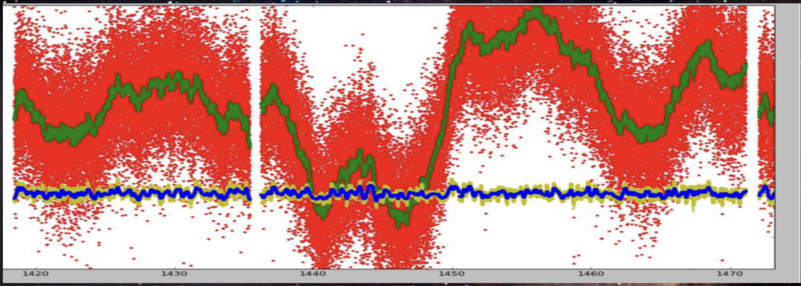
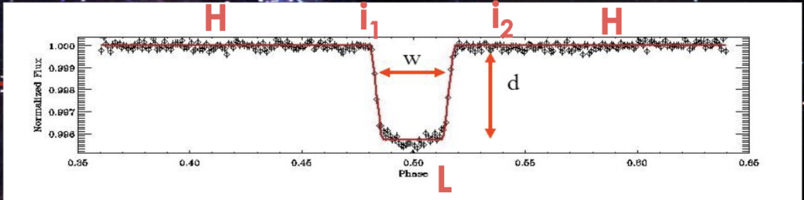

## Exoplanet Detection Using Machine Learning

### Project Description
The Kepler mission was launched to figure out earthlike planets revolving along with stars. There have been more than 1000 confirmed stars with exoplanets thanks to this mission and more than 3000 stars with potential planets around it. The methodology used is the Transit Photometry Method where a distant planet is detected by measuring the change in flux of a star as it passes between a planet and the earth. Thus if the planet is present around the star, there would be a minuscule reduction in the flux intensity of the star during transit.

### Dataset

The dataset was made available as a part of the Annual Inter-IIT competition held in IIT Madras. This dataset contains flux of over 5000 stars in a time series form. It's a binary classification problem with label 1 representing that the star has no confirmed exoplanet and 2 representing that the star has at least one exoplanet.

### Data Preprocessing

**Noise Removal:**
The random bunching of photons introduces the noise in the measured flux. These are also known as shot noise. We applied a Gaussian filter to attenuate the high-frequency flux thus smoothing some random shot noises in the data.

**Standardization:**
The flux of the exoplanet depends on how big it is. It also depends on the type of the exoplanet, distance, etc. Thus it becomes very important to put the data on the same scale. We scaled the flux data between 0 to 1.

### Feature Engineering

Although advanced deep learning methods could have been used to solve the problem, we decided to use a traditional machine learning algorithms to truly understand the data and figure out the most important features. We used Box Least Square(BLS) Method to derive features from the flux data. 
**BLS Method**

The algorithm applies the weighted least square and fits the box-shaped function to get parameters like Period(P), High, Low, fractional transit length.

**Orbital Period:** The interval between consecutive planetary transits.
**Transit Duration:** The duration of the observed transit.
**Transit Depth:** The fraction of the stellar flux lost at the minimum of the planetary transit
**Number of Transit:** The number of expected transits or partially observed transits associated with the planet candidate occurring within the searched light curve.
**Ingress:** Ingress lasts from when the planet meets the solar limb(contact 1) until the instant at which the planetary disk is encompassed(Contact 2).
**Egress:** The time between contact 3 and contact 4

### Data Modelling

Note: We used an f-score to evaluate the model as the data was imbalanced. 
We started with a basic Regression model to evaluate the baseline performance. The F-score came out to be 0.52. This was probably due to nonlinearity. Further, we used some of the complex models which includes

1. Principal Component Analysis(For Dimentionality Reduction)
2. Support Vector Classifier
3. Multilayer Perceptron
4. K-Nearest Neighbours
5. Adaboost

 

We then ensembled the prediction of these 4 models and used gradient boosting to compute the final prediction. The final F-score we got for this model is 0.862.

Further details and references can be found in the presentation available on Github.
